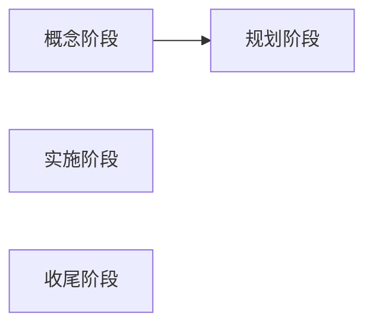

# 1. 项目管理的概念和流程
## 项目管理的定义
Def： 为达到项目目标，项目负责人和项目组织运用系统理论和方法，对项目进行全过程和全方位的策划、组织、控制、协调的总称。

## 项目管理的要素
### 5大过程组
1. 启动
2. 计划
3. 实施
4. 监控
5. 收尾

### 9大知识体系
1. 项目整体管理
2. 项目范围管理
3. 项目时间管理
4. 项目费用管理
5. 项目采购管理
6. 项目风险管理
7. 项目人力资源管理
8. 项目沟通管理
9. 项目质量管理

### 项目特性
- 普遍性
- 一次性
- 冲突性
- 目的性
- 制约性

### 项目生命周期

### 项目生命周期的基本类型
1. 预测型项目生命周期（瀑布模型）
2. 适应性项目生命周期（敏捷开发）
3. 迭代与增量型生命周期（螺旋模型）

### 项目生命周期特点
1. 成本和人的需求最初较少，发展过程中增加，项目结束时剧烈减少
2. 项目发展中，不确定性降低，成功性增加
3. 项目涉及人员的能力对产品的最终特征和最终成本的影响力随项目发展逐渐削弱
4. 项目生命周期每个阶段都用其工作成果作为完成标准，对每个阶段的关键工作成果进行回顾，可以了解项目阶段的完成情况，并以此决定是否进入下一阶段。*有时后续阶段在前一阶段工作通过验收前开始，称***快速跟进***，必须在风险可控的范围内进行*